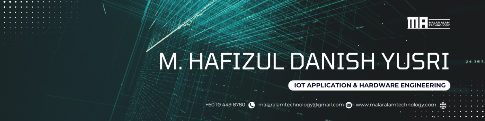

<!-- Optional banner (recommended) -->
<!-- If you upload a banner to: assets/banner.png, uncomment the next line -->

# Hi, I’m MHDanish 👋  
### Mechanical & Electronics Engineer → Software + IoT Builder

I build **reliable real-world systems**: IoT devices, smart dashboards, payment/kiosk integrations, and amazing frontends — engineered for stability, compatibility, maintainability, and deployment.

 

 
 

---

## 🧠 What I’m focused on
- 🔧 **Hardware ↔ Software integration** (Nvidia Jetson Orin Nano/ Orin NX/ STM32 / ESP32 & Arduino / Raspberry Pi, sensors, gateways, field deployment)
- 💳 **Payment / kiosk workflows** (terminal integrations, reliable comms, logs, recovery flows)
- 🧩 **Admin dashboards** (Bootstrap + Vanilla JS / AdminLTE-style, charts, i18n-ready UX)
- 🌐 **Backend APIs** (Python/Java stacks, clean contracts, production-minded structure)

---

## 🚀 Startup: Malar Alam Technology (Solution Provider)
**Malar Alam Technology** builds practical systems for SMEs and real-world operations — combining **engineering + software + onsite integration**.

**What we build / deliver**
- 🌧️ **IoT warning & monitoring systems** (disaster/alerts, sensor logging, dashboards)
- 🏨 **Resort/Hotel websites + booking systems** (demo → production-ready)
- 🧾 **Custom ERP / POS / CMS** for SMEs (workflows, reporting, role-based access)
- 📊 **Admin dashboards** (management views, analytics, operations control)
- 📷 **CCTV systems & installation**
- 🚪 **Autogate systems & installation + IoT integrations**

> Goal: deliver solutions that are **stable, maintainable, and scalable** — not just “a working demo”.

---

## 🛠️ Languages & Tools

---

## 📌 What you’ll find in my GitHub
- **IoT prototypes & device integrations** (logging, sensors, comms, reliability)
- **Dashboards / admin panels** (SPA-style structure, reusable components, mock-data demos)
- **Backend services** (API design, structured error handling, deployment-ready patterns)
- **Automation + tooling** (scripts, utilities, builders)

---

<!-- ## 🔥 Stats

 -->

<!-- Optional streak card -->
<!-- 

  

 -->

---

## 🤝 Contact
- LinkedIn: https://www.linkedin.com/in/m-hafizul-danish-yusri/
- X: https://x.com/MHD4N1SH
- Instagram: https://www.instagram.com/mhd4n1sh/

